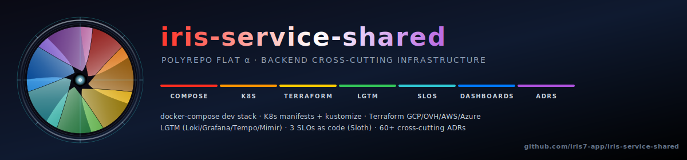

[](LICENSE)


Shared **infrastructure + observability + CI templates + cross-cutting docs**
for the [iris7](https://gitlab.com/iris7) project family. Submoduled
into `iris-service-java` and `iris-service-python` under `infra/shared/`.

Part of **Iris**, an observability-first showcase across 7 facets.
See [iris-service-java](https://gitlab.com/iris7/iris-service-java)
for the master narrative + visual.

## What this proves

- **Polyrepo coherence without monorepo lock-in** : 4 sibling repos share
  this submodule for the 80% of infra that's truly identical (compose stack,
  K8s manifests, OTel config, CI templates, cross-cutting ADRs, SLO rules,
  Grafana dashboards). Submodule pin = no cascade breakage when shared moves.
- **Operational hygiene scripts** : default-branch verification, runner
  healthcheck cron, GCP + OVH budget alerts, release automation, stability
  checks. Each script has a `--dry-run` mode + a launchd plist when
  applicable.
- **Cross-cutting Grafana dashboards** : SLO Overview (spans Java + Python
  via Sloth's universal `slo:current_burn_rate:ratio` metric). Repo-specific
  dashboards (latency heatmap, Apdex, breakdown by endpoint) live IN their
  own repos at `<repo>/infra/observability/grafana-dashboards/` because
  they query repo-specific metric names (Java's
  `http_server_requests_seconds_*` vs Python's `starlette_*`).
- **PrometheusRules** : generated per-repo via Sloth + each repo's
  `wrap-as-prometheusrule.py`, output to that repo's
  `deploy/kubernetes/observability-prom/iris{-py}-slo.yaml`. The
  cross-cutting `iris-alerts.yaml` (backend-down, kafka lag) stays here
  in shared.
- **Renovate base preset** : 4 repos share common config (auto-merge patch,
  Docker pinDigests, codeowners assignee) ; repo-specific groups (Spring Boot,
  FastAPI, Angular) preserved by `bin/ship/renovate-sync.sh`.

## What lives here (backend infrastructure only)

Since 2026-04-26 the iris-7 family uses **two shared submodules** :
- **this repo** = backend infrastructure (clusters, terraform, K8s, OTel, dev stack) — consumed by **java + python** only
- [`iris-common`](https://gitlab.com/iris-7/iris-common) = universal cross-repo conventions (release scripts, ADR tooling, Conventional Commits, Renovate base) — consumed by **all 4 repos** (java + python + ui + this repo via `infra/common/`)

| Path | Purpose | Consumer |
|---|---|---|
| `compose/dev-stack.yml` | Postgres + Redis + Kafka + LGTM + Ollama | java + python `bin/demo-up.sh` |
| `bin/budget/` | GCP + OVH budget alert scripts | java + python (cron via launchd) |
| `bin/cluster/ovh/` | OVH managed-k8s cluster up/down/init scripts | java + python on-demand |
| `bin/dev/` | Healthchecks + chaos burn-SLO-budget + multi-section stability checker | local dev + cron |
| `bin/launchd/` | macOS launchd plists (budget cron, runner healthcheck) | local dev workstations |
| `ci-templates/docker-multiarch.yml` | Multi-arch Docker buildx template (java only ; UI doesn't build multi-arch) | java |
| `infra/common/` | Submodule pointing to [iris-common](https://gitlab.com/iris-7/iris-common) | self-reference for release scripts + ADR drift |
| `infra/observability/grafana/dashboards-lgtm/` | Cross-cutting Grafana dashboards (SLO Overview spans both services + demo + service-control + logs) | LGTM provisioning |
| `infra/observability/` | OTel Collector + Prometheus shared config | java + python |
| `deploy/kubernetes/` | Cross-cutting K8s manifests (Argo CD apps, ESO, Argo Rollouts, network policies, observability stack) | clusters |
| `deploy/kubernetes/observability-prom/iris-alerts.yaml` | Cross-cutting alert rules (backend down, kafka lag, etc.) | kube-prometheus-stack operator |
| `deploy/terraform/{gcp,ovh}/` | Cluster lifecycle | manual / CI |
| `docs/adr/` | 7 backend cross-cutting ADRs (observability, SLO, ESO, multi-cloud terraform) | reference |
| `docs/slo/review-cadence.md` | Monthly + quarterly + post-incident SLO review framework | SRE team |
| `docs/runbooks/`, `operations/`, `architecture/`, `demo/` | Backend operations docs | reference |

**Universal scripts moved out 2026-04-26** : `bin/ship/{pre-sync,changelog,gitlab-release,renovate-sync,check-default-branch}.sh`, `bin/dev/regen-adr-index.sh`, `ci-templates/conventional-commits.yml`, `renovate-base.json`, and ADRs 0001 + 0055 + 0057 + 0059 — all now in [iris-common](https://gitlab.com/iris-7/iris-common). Call them via `infra/common/bin/...` (here) or `infra/common/bin/...` (in any consumer).

## Why a separate repo (and not merged into one of the others)

Per cross-cutting [ADR-0001 (in iris-common)](https://gitlab.com/iris-7/iris-common/-/blob/main/docs/adr/0001-shared-repo-via-submodule.md) :
shared backend content is genuinely 80%+ identical between Java + Python — extracting
removes drift risk + lets us bump postgres/kafka/redis versions in one place.
Submodule (vs polyrepo include or copy-paste) chosen because it pins a
specific SHA in each consumer (no breakage cascade) AND keeps the consumer
repos' visual structure clean (one folder = one boundary).

## How to update

```bash
# In iris-service-shared :
$ cd /Users/benoitbesson/dev/workspace-modern/iris-service-shared
$ git switch main
# … edit, commit, push …
$ git push origin main

# In the consumer repo (java OR python) :
$ cd ../iris-service-java     # or ../iris-service-python
$ cd infra/shared
$ git pull origin main
$ cd ../..
$ git add infra/shared
$ git commit -m "chore(shared): bump SHA — <reason>"
$ git push
```

The consumer repo's CI re-runs against the new shared SHA — that's the
verification step. Tag stable-vX.Y.Z when a milestone lands.

## How to clone (consumer side, first time)

The submodule pointer doesn't auto-populate. After cloning the parent :

```bash
git clone https://gitlab.com/iris-7/iris-service-java.git
cd iris-service-java
git submodule update --init --recursive
# OR : git clone --recurse-submodules <parent-url>   # both at once
```

## See also

- [CHANGELOG](CHANGELOG.md) — release notes per checkpoint
- [CONTRIBUTING](CONTRIBUTING.md) — workflow + multi-repo blast radius warning
- [SECURITY](SECURITY.md) — vulnerability disclosure
- [ADR-0001 — Shared repo via submodule](docs/adr/0001-shared-repo-via-submodule.md)
- [ADR-0058 — SLO/SLA via Sloth](docs/adr/0058-slo-sla-with-sloth.md)
- [SLO review cadence](docs/slo/review-cadence.md)
- Sibling repos : [java](https://gitlab.com/iris-7/iris-service-java) · [python](https://gitlab.com/iris-7/iris-service-python) · [ui](https://gitlab.com/iris-7/iris-ui)

## License

[BSD-3-Clause](LICENSE)
